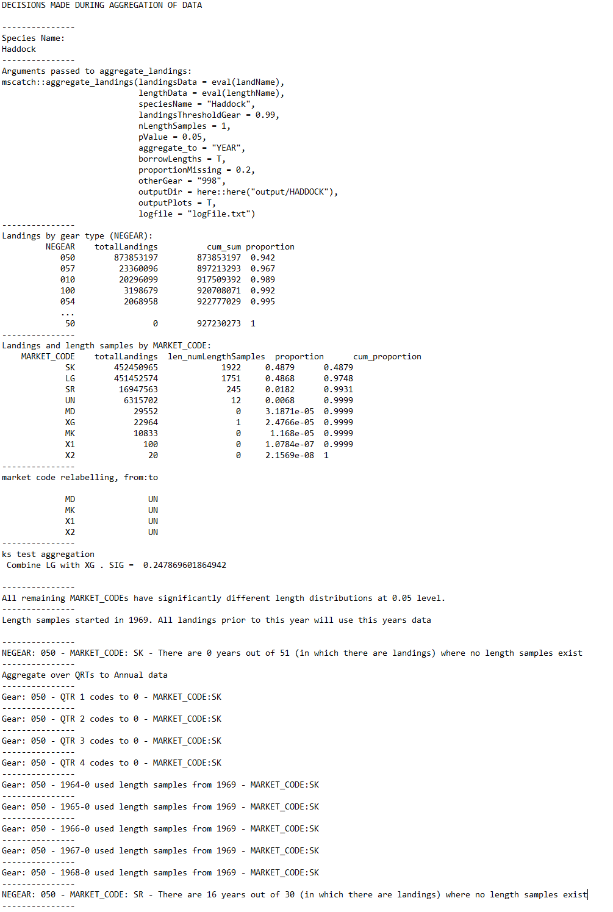
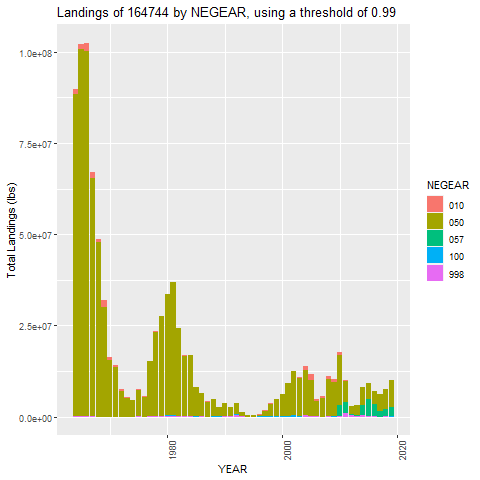
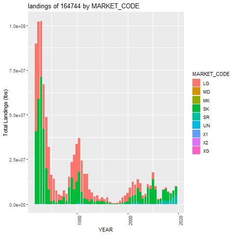
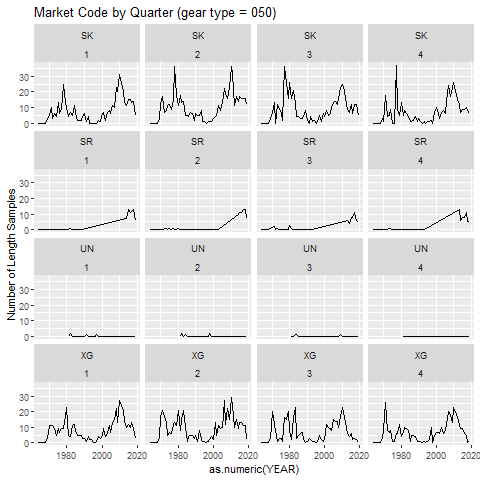
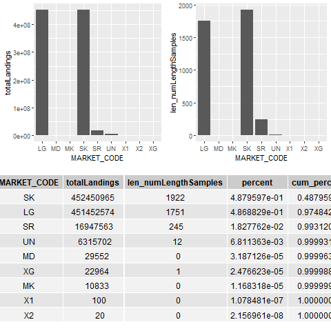
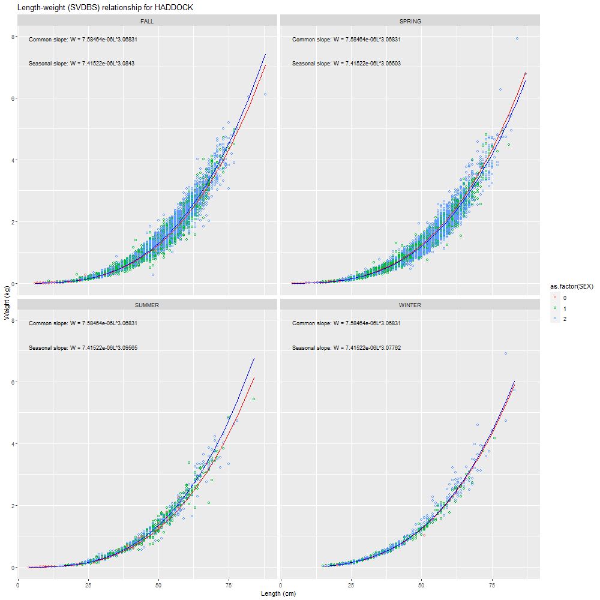

```{r setup, include = FALSE}
knitr::opts_chunk$set(
  collapse = TRUE,
  comment = "#>"
)
library(magrittr)
```

## Logfile

Several items are printed to the log file

* Species name
* The functional call made to [`aggregate_landings`](../reference/aggregate_landings.html)
* Table of landings by gear
* Table of landings by market category
* Decisions relating to market category aggregations whether due to insufficient samples or due to similar length distributions.
* Decisions relating to how length samples are used/borrowed from other time periods

Below is a sample from a logfile:

```{r logfile, echo = F,out.width="100%"}

```

## Plots

A subset of the full suite of plots are shown below

### Landings by NEGEAR

```{r fig1, echo = F,out.width="100%"}

```

### Landings by MARKET_CODE

```{r fig2, echo = F,out.width="100%"}

```

### Number of length samples by QTR

```{r fig3, echo = F,out.width="100%"}
knitr::include_graphics("figures/length_samples.png")
```

### Number of samples by QTR/market category for NEGEAR 50

```{r fig4, echo = F,out.width="100%"}

```


### Market category lengths

```{r fig5, echo = F,out.width="100%"}
knitr::include_graphics("figures/market_category_lengths.png")

```


### Market category landings

```{r fig6, echo = F,out.width="100%"}

```


### Length Weight data

```{r fig7, echo = F,out.width="100%"}

```


