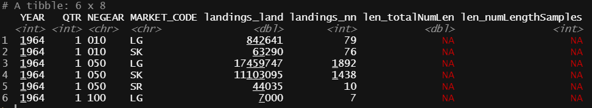
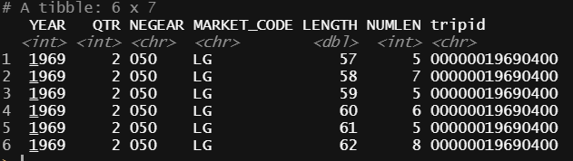

```{r setup, include = FALSE}
knitr::opts_chunk$set(
  collapse = TRUE,
  comment = "#>"
)
```

# General overview {#gen}

1. From "RAW" landings data (mv_cf_landings, AA t/s tables) we need to:

* Assign all missing areas and/or assign all trips to an EPU
* 10 min square designations exist in mv_cf_landings from 1994 onward. (Sean, Mike presentation in 2010 "Ecosystem – Based Fishery Management for the New England Fishery Management Council: Part Deux: Spatial Considerations" shows landings by gear type from 1998-2009. Expanding to earlier years might not be possible.) So then how get landings to EPU for earlier years? If use trip characteristics to do this we are assuming the fishery has remained somewhat constant over time. Is this realistic? What to do?
* missing gear type can be dealt with in length expansion. (Assume unknowns have proportional make up of the known gear types)
* Aggregate landings by year, quarter, gear, market category, stat area assigned to proper ecoregion:

2. From "RAW" length data (mv_cf_len, LEN AA tables) we need to 

* Determine the number of length samples and total number of lengths by year, quarter, gear, market category, stat area assigned to proper ecoregion. (G.S -"Summarize biological samples by year, gear, quarter, market category, stat area. Compare to landings.")
* Assign AREA to EPU. (May need to try and link "trip" to landings data after EPUs assigned to determin EPU)

3. Then merge both data sets. This will be the starting dataset needed for the following rules by G.S.

4. Now start to  *Combine* cells to increase sample sizes or *interpolate* individual missing cells? 

For example: the data should be in this format (mv_cf_landings: species_itis = 164744, Haddock):
``` {r table1 , echo = F, out.width="100%"}
#data <- mscatch::sampleData_164744
#knitr::kable(head(data))

```

where,

**landings_land** = total landings for YEAR,QTR,NEGEAR,MARKET_CODE

**landings_nn** = number of "trips" associated with landings

**len_numLengthSamples** = number of trips where length samples were (unique **tripid**)

**len_totalNumLen** = Total number of fish sampled in these trips (from table below).

NA indicates no data

with the length data in this format (mv_cf_len):

``` {r table2 , echo = F, out.width="65%"}
#data <- mscatch::sampleLengths_164744
#knitr::kable(head(data))

```

where,

**tripid** = id for a trip where samples were taken

**LENGTH** = length of a sampled fish

**NUMLEN** = number of fish sampled for stated **LENGTH** in a given **tripid**

5. Obtain length-weight data (from SVDBS) and fit length-weight relationship (or get param values from database svdbs.LENGTH_WEIGHT_COEFFICIENTS) 

$$ W_i = \alpha L_i ^ \beta e^{z_i}$$


for fish i, where $\alpha$ and $\beta$ are intercept and slope parameters (on log scale) and $z_i \sim N(0,\sigma^2)$ 

This model can be extended to :

$$ W_{ji} = \alpha L_{ji} ^ {\beta_j} e^{z_i} $$
for season j, j= 1, ..., 4 (spring, summer, fall, winter) or sex j, j = 1, ..., 3 (0, 1, 2 categories) or extended further to include season:sex combinations. These models are all nested and can therefore be tested using standard statistical methods.


6. Apply length-weight relationship to length distributions and split aggregated landings accordingly. All unclassified landings are then expanded using a similar method. See the [method for expanding lengths ](#expand) section below. 


# Rules of aggregation

To determine "similar length distributions" we could use the two sample Kolmogorov-Smirnov test. The test compares empirical CDF's. We would construct the empirical CDF from the histogram of length's (over all samples) at 1 cm intervals. Use stats::ks.test. Many ties - may need to perform a randomization test

In many stock assessments each year may result in a different level of aggregation (i.e quarters, semesters or different gear types).
For the first pass here we will use the same aggregation level for all years. Maybe a good exercise to compare results.

Note: minimum number of length samples ~ 1 per 200 metric tonnes landed. (unwritten rule of thumb, check )

(Within each year, t)

## Combine:

* Are there *gear* types with total landings greater than 0 but total sample sizes less than *X*?  This step ignores time (YEAR, QTR) and  MARKET_CODE and looks at aggregated landings by gear type to determine dominant gear types in fishery. Number of distinct gear types controlled by a parameter indicating the % of landings to be accounted for by distinct gear types. (Others lumped in _otherGear_ category)

  ```
    + if YES: Combine gear types (explore to see if combined lengths similar) to increase sample size or Ignore and continue (add to total at the end).
    + if NO: Count your blessings and continue.  
    ```
    
* Are there *market categories* (they are not on ordinal scale) with total landings greater than 0 but sample sizes less than *X*? (after combining gears). If there are market categories with length samples < *X* the user must decide which categories to combine. Often these MARKET_CODEs have small landings. We then compare length distributions (Kolmogorov-Smirnov test) of remaining MARKET_CODES to determine further aggregation. Currently this is done by aggregating length samples over YEAR and QTR. (This can and should be relaxed at a later date)

    
	  + if YES: combine market categories with similar length distributions. 
	  + if NO : Count your blessings and continue.  
	  
	  
* Are there *quarters* with landings but sample sizes less than *X*? A threshold for percentage missing samples "allowed" is implemented. For each NEGEAR/MARKET_CODE combo we determine, for each QTR, the number years that have length samples. The mean of this is used as a measure of "completeness" (The ~# years with samples). If this mean exceeds a user defined threshold then we borrow length sample data for missing QTRs from the previous years equivalent QTR. (If this is also missing we look back another year and so on). If the mean falls below the defined threshold (too many missing length samples at QTR level) the data is aggregated to the YEARly level and we follow a similar process. However prior to aggregation we test (ks-test) for differences in length distributions among market categories. If distributions are sig different we do not aggregate MARKET_CODEs and proceed. Otherwise MARKET_CODEs are aggregated - not complete yet. The YEARs with missing length samples borrow from the closest YEAR with length samples (either direction). In most cases length sampling began at a point in time after landings were recorded. For the YEARs with landings prior the length sampling start date we borrow length samples either by QTR or by YEAR (as explained above) from the most recent YEAR with length samples.

NOTE: **This has been simplified until we can figure out how to deal with unclassifieds. The user decides if aggregation (for all MARKET_CODEs) occurs at QTR or annual level. UNclassified samples are then aggregated in a similar fashion to allow easier expansion of UN lengths. The otherGear category is ALWAYS aggregated to annual data. If there are no length samples in previous year(s), same quarter, we resort to nearest neighbor. If no samples exist at all, we borrow from another gear type, nearest neighbor **

	  + if YES: Create semesters?  (Currently semesters are skipped and jump straight to annual)
	  + if NO: Count your blessings and continue.  
	  
* Are there *strata* with landings but sample sizes less than *X*? We have one *strata* (EPU) so this is skipped (Code can be generalized to include this. Rules will need to be made as to where to borrow from and when)

	  + If YES: define groups of similar strata  
	  + If NO: Count your blessings and continue.  
	  
* Interpolate remaining holes.  

	  + Select length within year/market category from adjacent strata or strata group (after determining if appropriate).  
	  + Select length within year/market category from adjacent quarter or semester (after determining if appropriate).  
	  + Select length within year/market category from adjacent year (after determining if appropriate).  
	  
* If unclassified market category and no other information available:  If length samples are available they are used for the given YEAR,NEGEAR otherwise the distribution is assumed to be that of all observed MARKET_CODEs

	  + Combine market category samples to create an unclassified  
	  + Use appropriate observer length samples to apply to unclassified. 
	  
* If holes remain  

	  + Calculate ratio of sampled to un-sampled landings and expand total length frequency such that expanded sample weight equals total landings weight for year t.


## Interpolate only:
If examination of sample matrix shows only sporadic missing cells with landings but sample sizes less than *X*:  

* Samples by year/gear/quarter/stat area/market category

	  + Nearest stat area within market category/quarter/gear/year  
	  	  + Keeping year/market category constant:  
	  	  	  + Adjacent quarter/ same stat area  
	  	  	  	  + Adjacent quarter/ any stat area within ecoregion  
	  	  	  	  	  + Adjacent semester/matching stat area  
	  	  	  	  	  	  + Adjacent semester/ any stat area within ecoregion  
                            +  If lengths by gear are similar: Alternative gear/same quarter/stat area	
	  	  	  	  	  	  	  	  + Alternative gear/same quarter/any stat area
	  	  	  	  	  	  	  	  	  + Alternative gear/semester/same stat area
	  	  	  	  	  	  	  	  	  	  + Alternative gear/semester/any stat area
	  	  	  	  	  	  	  	  	  	  	  + No options- extrapolate to total

*Or combination of both approaches*


## Vocabulary
Definitions to think about.

* Area - could be stock area or EPU

	  + Stat area - smallest unit that the landings are reported to 
	  + Stock area - stock assessment footprint (combined stat areas)
	  + EPU - ecological production unit
	  
* Time - quarter, semester, annual	

	  + Quarter - 3 month
	  + Semester - 6 month
	  + Annual - 12 month
	  
* Length - market categories, cm, 

	  + Market categories - could vary over port, time, 

## Method to expand lengths  {#expand}

### Known market codes

For each unique category (YEAR, QTR, NEGEAR, MARKET_CODE) we have both total landings (metric tons) and a sample of fish lengths for this category. The sampled fish lengths are converted to weights using the [weight-length relationship](#gen) found in the gerneral overview. The resulting sample fish weights are mean weights (metric tons). The weight distribution of sampled fish is then scaled to the weight of total landings. This scaling assumes that the landed (commercial) fish have the same length distribution as the sampled fish.

For each unique category we define 

$$expansion \; factor = \frac{total \; landings}{\sum sampled \; fish \; weigths} $$
Therefore the expanded weights of the sample (to meet the total landings)

$$expanded \; sample\; weights \; = expansion \; factor \;*\; sampled \; fish \; weights$$

### Unclassified market code

The unclassified landings for a specific (YEAR, QTR, NEGEAR) are assumed to be a mixture of fish lengths similar to that in the observed MARKET_CODEs. Therefore the length distribution for the unclassified landings are assumed to have the same distribution as the length distributions of the landed fish in all of the known market codes combined. The sampled fish lengths (from the known market codes) are converted to weights using the [weight-length relationship](#gen) found in the gerneral overview. 

For each unique category we define

$$expansion \; factor = \frac{landings \; of \; unclassifieds}{\sum landings \; of \; known \; market \; codes  } $$
Therefore the expanded weights of the unclassified sample

$$expanded \; unclassified\; weights \; = expansion \; factor \;*\; fish \; weights \; of \; known \; market \; codes$$


# Discards

Need to deal with discards in a similar fashion.
It seems that Susan Wigley has a SAS script that most/some stock assessment scientists use to help with this.
Edit: Spoke to Susan Wigley she says that they will have all of the discard estimates over time for all of the species in a database similar to that of the landings, length, age databases. This will make life heck of a lot simpler for us.
			
# NAFO data

Non US landings need to be integrated also.


